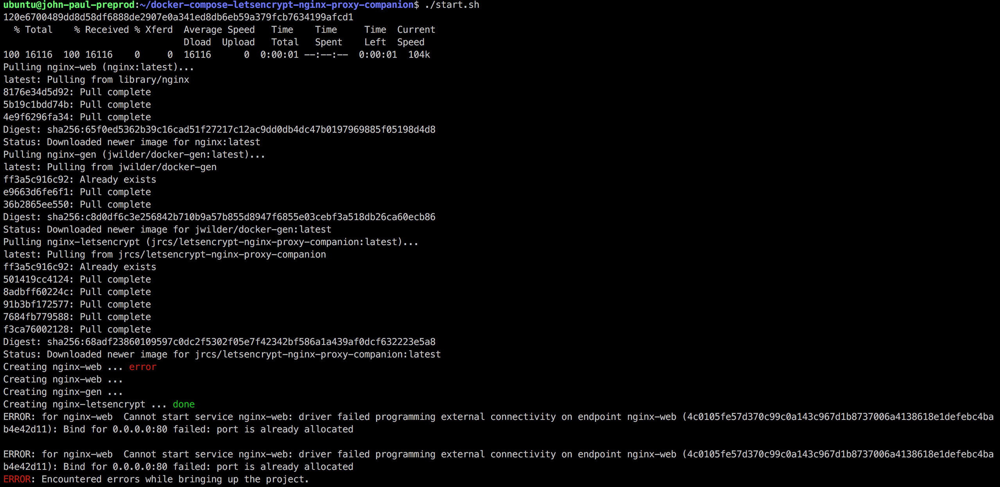

# [MO] Setup HTTPS on your docker environment (~15 min)

## Owner: [Sammy Teillet](https://github.com/samox)

## Control points

 

If, _as an expert of docker_, you want to adapt the standard to the context of your project, you have to check that:



* [ ] server listen port `80` and `443` 
* [ ] server redirect port `80` to `443` with `301: Moved Permanently`
* [ ] proxy should renew certificates automatically before they expire (letsencrypt certificates have 90 days of validity)
* [ ] you should get at least `A` when checking https://www.ssllabs.com/ssltest/
* [ ] you should check in the report of https://www.ssllabs.com/ssltest/ that the server devices range cover your definition of DONE : eg, if you need to support old IE or old android, you have to lower the security enough for compatibility

## Prerequisites

* [ ] You have a staging environment with docker
* [ ] You can ssh to the server
* [ ] Make sure you have the docker rights `sudo usermod -aG docker $YOUR_USER_NAME`

## Steps  (~15 min)

### Install the nginx-proxy companion (~5 min)

- Connect to your server `ssh user@your.domain`
- Clone the nginx-proxy-companion [project](https://github.com/evertramos/docker-compose-letsencrypt-nginx-proxy-companion) on the server at the root of the server.

```bash
git clone git@github.com:evertramos/docker-compose-letsencrypt-nginx-proxy-companion.git
```

- Create a `.env` file

```bash
cd docker-compose-letsencrypt-nginx-proxy-companion
cp ./.env.sample .env
```

- Set the `NGINX_FILES_PATH=/srv/nginx/data` in the `.env`
    - `vim ./.env`
    - line 41 replace `NGINX_FILES_PATH=/srv/nginx/data`(or a different path if you prefer)

 **CHECK**

Try to launch the companion by running:

```bash
./start.sh
```

You should have the following error because the port 80 is already used by your app docker:

```
ERROR: for nginx-web  Cannot start service nginx-web: driver failed programming external connectivity on endpoint nginx-web (4c0105fe57d370c99c0a143c967d1b8737006a4138618e1defebc4bab4e42d11): Bind for 0.0.0.0:80 failed: port is already allocated
```





### Configure your project to use the companion (~5 min)

- Remove the binding 80 port command, but expose it

```diff
version: '3'
services: 
  your-web-app: #It should contain port: "80:80"
    # ... 
-   ports:
-     - "80:80"
+   expose:
+     - 80
```

- Configure the app to use the network created by the companion (`webproxy` is the default name)

```diff
version: '3'
services: 
    # ... 

+networks:
+  default:
+     external:
+        name: webproxy
```

 **GO FURTHER**

https://blog.docker.com/2016/12/understanding-docker-networking-drivers-use-cases/



- In your project set 3 environment variable : `VIRTUAL_HOST`, `LETSENCRYPT_HOST`, `LETSENCRYPT_EMAIL`. The email will be used by _Letsencrypt_ to notify you if the certificate expire.There are 2 ways:
    - In the docker-compose file
    - In your prod.env file that is read by your Dockerfile.


 **RECOMENDED WAY**

Update the .env file of your web-app docker



- In the `./env/prod.env` add the following:

```diff
#... other env variable
+ VIRTUAL_HOST=my.domain.cloud.bam.tech
+ LETSENCRYPT_HOST=my.domain.cloud.bam.tech
+ LETSENCRYPT_EMAIL=your@email.com
```

 **OTHER solution**

If you have no .env file you an also Update the docker-compose-prod file


```diff
version: '3'
services: 
  your-web-app: #It should contain port: "80:80"
    # ... 
    environment:
+      - VIRTUAL_HOST=my.domain.cloud.bam.tech
+      - LETSENCRYPT_HOST=my.domain.cloud.bam.tech
+      - LETSENCRYPT_EMAIL=your@email.com
```




### Make the switch (~5 min)

 **BUSINESS INTERRUPTION**

You will have to shut down your docker (so the port 80 is available), so during this step your domain  won't be accessible.



- Cut your app docker:

```bash
cd your-project-directory
docker-compose -f docker-compose-prod.yml down
```

- Start the companion (go to the companion directory): 

```bash
cd ../docker-compose-letsencrypt-nginx-proxy-companion
./start.sh
```

- Launch your project docker again:

```bash
cd -
docker-compose -f docker-compose-prod.yml up -d
```

 **CHECK**

- Check the validity of your domain, go to https://your.domain
- Go [there](https://www.ssllabs.com/ssltest/) and check your domain. Usefull tip: go to the __Handshake Simulation__ section and check the supported devices.


