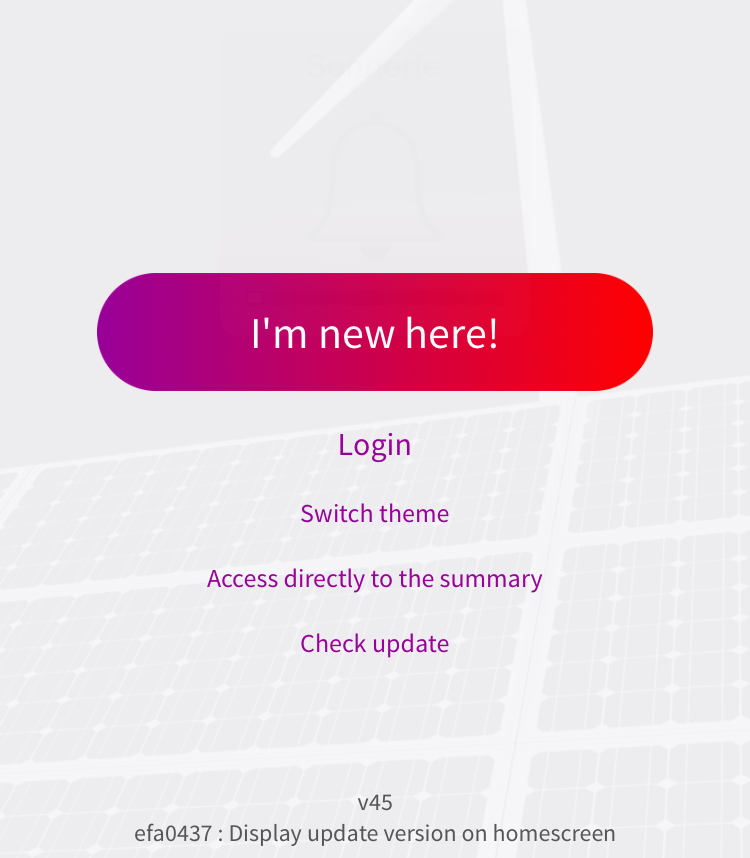

# [MO] Install CodePush on your project *(~1h)*

## Owner: Louis Lagrange

## Prerequisites *(~2min)*

- [ ] A running React Native app, preferably started with the generator
- [ ] A compatible React Native version (see [compatibility table](https://github.com/Microsoft/react-native-code-push#supported-react-native-platforms))

## What is CodePush?

> A React Native app is composed of JavaScript files and any accompanying images, which are bundled together by the packager and distributed as part of a platform-specific binary (i.e. an .ipa or .apk file). Once the app is released, updating either the JavaScript code (e.g. making bug fixes, adding new features) or image assets, requires you to recompile and redistribute the entire binary, which of course, includes any review time associated with the store(s) you are publishing to.

CodePush allows to rebuild and push only the modified JS code.

Pros:
- Faster builds
- Easier to update: no need to download the whole app again on HockeyApp
- See deployment history and statistics
- Easy rollbacks
- If you enable it in production, you can install updates silently and automatically

Cons:
- You rely on Microsoft Azure's servers

Here's an example on ***REMOVED***'s ***REMOVED*** app, where we enabled it on staging in order to speed up development (at the bottom of the screen).


## Steps

### 1. Install code-push cli *(~1 min)*

```bash
npm install -g code-push-cli
```

*Check:* `code-push -v` should give you a version.

### 2. Login into code-push *(~4 min)*

Login into GitHub with `***REMOVED***`. In your terminal:

```bash
code-push register
```

and finish the login process using GitHub.

*Check:* `code-push whoami` should give you your GitHub email.

### 3. Install the react-native module *(~5 min)*

Lookup the compatible version (we'll name it `<your.version>`) in the [compatibility table](https://github.com/Microsoft/react-native-code-push#supported-react-native-platforms).

```bash
# Add the npm dependency
yarn add react-native-code-push@<your.version>
# Register your Android app
code-push app add <MyApp>-android android react-native
# Save the Staging token for later use
# Register your iOS app
code-push app add <MyApp>-ios ios react-native
# Save the Staging token for later use
# Link the native modules. Paste your Staging tokens when prompted.
react-native link react-native-code-push
```

*Check:* your app should build with the binary CodePush modules. The deploy keys are present in `Info.plist` and in `MainApplication.java`.

### 4. Update your code *(~35 min)*

#### Update App.js *(~10 min)*

```js
// @flow
import React, { Component } from 'react';
...
import codePush from 'react-native-code-push';
import { ENV } from 'MyApp/environment'

const codePushOptions = {
  updateDialog: true,
  installMode: codePush.InstallMode.IMMEDIATE,
  checkFrequency: codePush.CheckFrequency.MANUAL,
};

class App extends Component {

  render() {
    ...
    return <Scenes />;
  }
}

const AppComponent = ENV === 'STAGING' ? codePush(codePushOptions)(App) : App;
export default AppComponent;
```

*Check:* No check on simulator. Your app should not crash (duh!).

#### Update Home.js *(~15 min)*

You can put the update process on any page you like, or even check if an update is available with a long press somewhere... It is up to you and your PO.

```js
import React, { Component } from 'react'
import codePush from 'react-native-code-push';
import { ENV } from 'MyApp/environment'
...

class Home extends Component {
  constructor (props) {
    super(props)
    this.state = {
      updateDescription: null,
      updateLabel: null,
      codePushStatus: null
    }
  }

  componentDidMount() {
    if (codePush && ENV === 'STAGING') {
      // Will fetch the latest update metadata
      codePush.getUpdateMetadata().then(update => {
        if (!update) return;
        this.setState({
          updateDescription: update.description,
          updateLabel: update.label,
        });
      });
    }
  }

  render () {
    return (
      <View>
        ...
        {ENV === 'STAGING' &&
          <View>
            <Button
              buttonText={this.state.codePushStatus || 'Check update'}
              onPress={() => {
                codePush.sync(
                  {
                    updateDialog: {
                      appendReleaseDescription: true,
                      descriptionPrefix: '\n\nModifications:\n',
                    },
                  },
                  SyncStatus => {
                    switch (SyncStatus) {
                      case codePush.SyncStatus.CHECKING_FOR_UPDATE:
                        this.setState({ codePushStatus: 'Checking for update' });
                        break;
                      case codePush.SyncStatus.AWAITING_USER_ACTION:
                        this.setState({ codePushStatus: 'Await action' });
                        break;
                      case codePush.SyncStatus.DOWNLOADING_PACKAGE:
                        this.setState({ codePushStatus: 'Downloading' });
                        break;
                      case codePush.SyncStatus.INSTALLING_UPDATE:
                        this.setState({ codePushStatus: 'Installing' });
                        break;
                      default:
                        this.setState({ codePushStatus: 'No update found' });
                    }
                  }
                );
              }}
            />
          </View>
        }
        ...
        {this.state.updateLabel &&
            <View style={{ position: 'absolute', bottom: 5, backgroundColor: 'transparent' }}>
              <Text style={{ fontSize: 12, textAlign: 'center' }}>
                {this.state.updateLabel}
              </Text>
              <Text style={{ fontSize: 12, textAlign: 'center' }}>
                {this.state.updateDescription}
              </Text>
        </View>}
      </View>
    )
  }
}

export default Home
```

*Check:* On simulator, you should see an update button if you force the env to staging. You can force the labels in the state variables `updateDescription` and `updateLabel` to check their position.

#### Create bin/deploy.sh *(~10 min)*

```bash
#!/bin/sh
read -r -p "Hard deploy [y/N] " response
case "$response" in

    [yY][eE][sS]|[yY])
      echo "Hard deploy"
      read -r -p "Did you bump the versions in fastlane/.env.staging [y/N] " response
        case "$response" in
          [yY][eE][sS]|[yY])
          ## Your standard hard deploy steps
          bundle exec fastlane android deploy --env=staging && bundle exec fastlane ios deploy --env=staging

          ;;
        esac
        ;;

    *)
      echo "Soft deploy"
      git stash
      git checkout staging
      git pull
      source fastlane/.env.staging
      MESSAGE=$(git log HEAD --pretty=format:"%h : %s" -1)
      echo "Deploying Commit : $MESSAGE"
      yarn
      code-push release-react -d Staging <MyApp>-android android -m --targetBinaryVersion $ANDROID_VERSION_NAME --des "$MESSAGE"
      code-push release-react -d Staging <MyApp>-ios ios -m --targetBinaryVersion $IOS_VERSION --des "$MESSAGE"
        ;;
esac
```

*Check:* `./bin/deploy.sh`, `y` should deploy your application exactly like before. `./bin/deploy.sh`, `n` should deploy with codepush.

#### Update package.json *(~1 min)*

```json
{
  ...
  "scripts": {
    ...
    "deploy:staging": "./bin/deploy.sh",
    ...
  },
  "dependencies": {
    ...
  }
}
```

*Check:* `yarn deploy.sh`, `y` should deploy your application exactly like before. `yarn deploy.sh`, `n` should deploy with codepush.

### 5. Test! *(~15 min)*

Open your PR, merge into the main branch. Have a hard build.
You can now deploy with code-push.

Bump your versions into `.env.staging` file before every hard deploy. If not, your JS code might try to call native libraries not present in your app.

### 6. Externalize the keys (optional) *(~10min)*

Externalize the keys in `Info.plist` and `AndroidManifest.xml`: see [https://github.com/kraynel/code-push-demo/commit/3cdd2496fab763a9814c1898c73505cd14fca9d1](https://github.com/kraynel/code-push-demo/commit/3cdd2496fab763a9814c1898c73505cd14fca9d1)

## Troubleshooting

You can try the CodePush [documentation](http://microsoft.github.io/code-push/docs/getting-started.html), and particularly the [react-native section](http://microsoft.github.io/code-push/docs/react-native.html).

You should also Andon the teams with a working CodePush process: [***REMOVED***](https://github.com/bamlab/***REMOVED***), [***REMOVED***](https://github.com/bamlab/***REMOVED***), ***REMOVED*** and ***REMOVED*** at ***REMOVED***.
